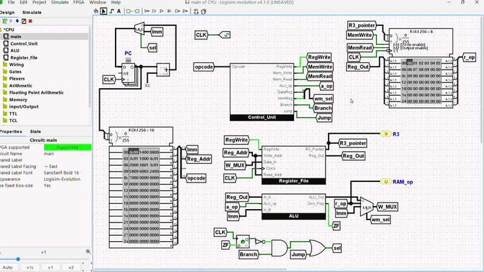
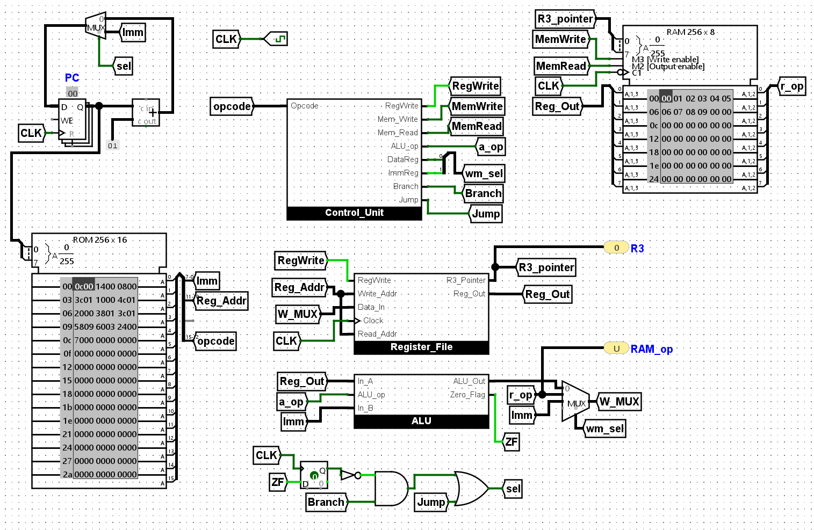
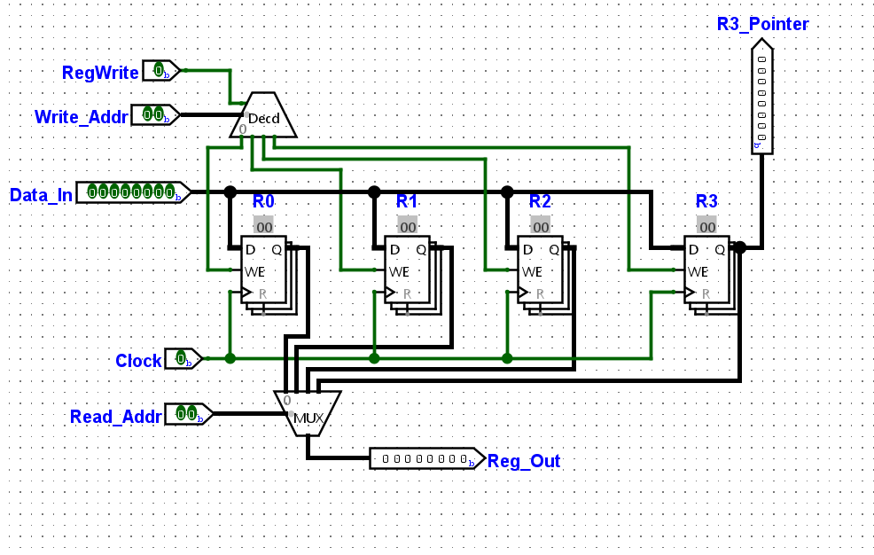
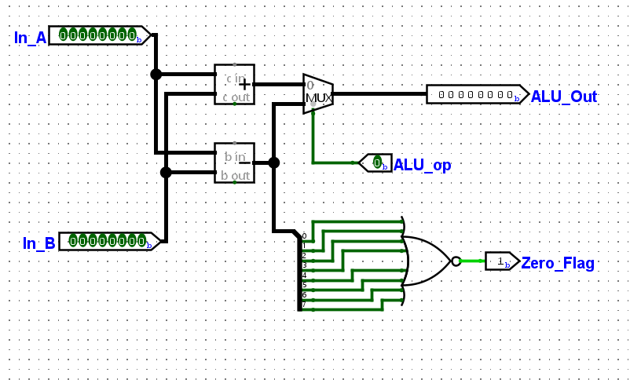
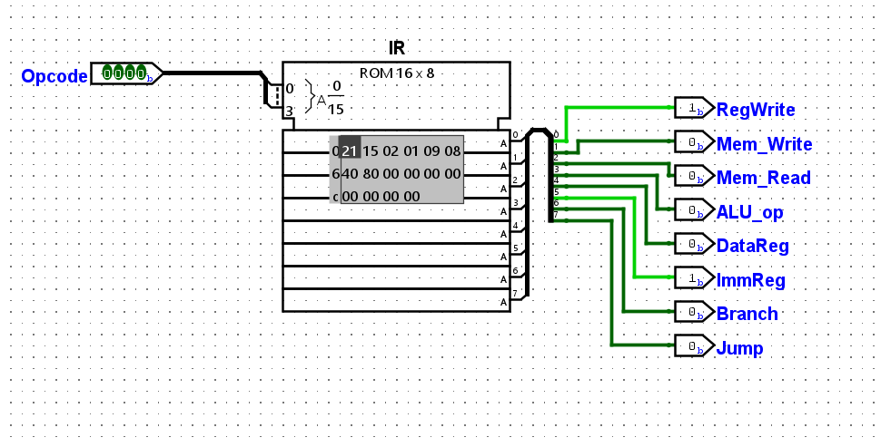

# ⚡ 8-bit ASIP CPU for Array Shifting

> A custom 8-bit Application-Specific Instruction Set Processor (ASIP) built in **Logisim Evolution** to execute a circular left shift on a 10-element array.
>
> In simple terms, I took a C-style array shift and pushed it all the way down into registers, control signals, ALU, memory access, and machine code.

---

## The Mission

The core objective of this project was to design and build a functional **8-bit microprocessor** that can execute a specific program: a circular left shift on `a[10]`.\
That means the CPU continuously moves each element to the previous index and wraps `a[0]` to the end.

This project is mainly about one thing:

> **Seeing how software becomes hardware.**

---

## What Makes This Project Cool

* It is a **real custom CPU**, not just a simulation of instructions.
* It uses a **custom ISA** made exactly for the target code.
* It shows how a `for` loop, `i++`, `CMP`, `LD`, and `JMP` become actual control wires and clocked behavior.
* It supports **live RAM modification**, so the array contents can be changed and tested directly.
* It is intentionally minimal: only the hardware needed for the job is built.

---
## Demo

## The Architecture at a Glance

---

## 🧩 Main Blocks

### 🗂 Register File

The register file is the CPU’s short-term workspace.

For this 8-bit design, I have used **4 registers**:

* `R0` — temporary value during shifting
* `R1` — stores `j = a[0]`
* `R2` — loop counter `i`
* `R3` — memory pointer

This keeps the datapath small and focused.

### 🧮 ALU

The ALU is the math engine of the CPU.

For this ASIP, it only needs to do what the target code requires:

* `ADD` for `i++` and pointer movement
* `SUB` for pointer correction
* `CMP` for checking and loop termination

Nothing extra.

### 🧠 Control Unit

The Control Unit is the brain behind the datapath.

Instead of hardwiring a huge logic tree, I used a **microcode ROM**. The opcode goes in, and the control "word" comes out.

That makes the whole design cleaner and much easier to reason about.

### 🧱 The Main Datapath

The main datapath connects everything together:

* Program Counter
* Instruction ROM
* Control Unit
* Register File
* ALU
* Data RAM

This follows a **Harvard-style architecture**, with instructions and data separated for clean execution.

---

## 🔌 Instruction Set

The instruction format is:

`[Opcode: 4 bits] [Register: 2 bits] [Unused: 2 bits] [Immediate/Address: 8 bits]`

### Instruction Map

| Opcode | Mnemonic | Hardware Action                    | Why it exists                     |
| ------ | -------- | ---------------------------------- | --------------------------------- |
| `0000` | `LDI`    | Load immediate into a register     | Initialize `i` and pointer values |
| `0001` | `LD`     | Load from RAM into a register      | Fetch `a[0]` and `a[i+1]`         |
| `0010` | `ST`     | Store register into RAM            | Write shifted values back         |
| `0011` | `ADD`    | Add immediate to a register        | Pointer increment and `i++`       |
| `0100` | `SUB`    | Subtract immediate from a register | Pointer correction                |
| `0101` | `CMP`    | Compare using subtraction          | Loop termination check            |
| `0110` | `JNE`    | Jump if not equal                  | Repeat the shift loop             |
| `0111` | `JMP`    | Unconditional jump                 | Keep the CPU running forever      |

---

## 🧬 Control Word Table

The Control Unit outputs an 8-bit control word:

| Instruction | Jump | Branch | ImmReg | DataReg | ALU | MemRd | MemWr | RegWr | Hex  |
| ----------- | ---- | ------ | ------ | ------- | --- | ----- | ----- | ----- | ---- |
| `LDI`       | 0    | 0      | 1      | 0       | 0   | 0     | 0     | 1     | `21` |
| `LD`        | 0    | 0      | 0      | 1       | 0   | 1     | 0     | 1     | `15` |
| `ST`        | 0    | 0      | 0      | 0       | 0   | 0     | 1     | 0     | `02` |
| `ADD`       | 0    | 0      | 0      | 0       | 0   | 0     | 0     | 1     | `01` |
| `SUB`       | 0    | 0      | 0      | 0       | 1   | 0     | 0     | 1     | `09` |
| `CMP`       | 0    | 0      | 0      | 0       | 1   | 0     | 0     | 0     | `08` |
| `JNE`       | 0    | 1      | 0      | 0       | 0   | 0     | 0     | 0     | `40` |
| `JMP`       | 1    | 0      | 0      | 0       | 0   | 0     | 0     | 0     | `80` |

---

## 🧾 Machine Code

This is the compiled program that performs the circular left shift.

| ROM Addr | Assembly    | Final Hex |
| -------- | ----------- | --------- |
| `00`     | `LDI R3, 0` | `0C00`    |
| `01`     | `LD R1, 0`  | `1400`    |
| `02`     | `LDI R2, 0` | `0800`    |
| `03`     | `ADD R3, 1` | `3C01`    |
| `04`     | `LD R0, 0`  | `1000`    |
| `05`     | `SUB R3, 1` | `4C01`    |
| `06`     | `ST R0, 0`  | `2000`    |
| `07`     | `ADD R2, 1` | `3801`    |
| `08`     | `ADD R3, 1` | `3C01`    |
| `09`     | `CMP R2, 9` | `5809`    |
| `0A`     | `JNE 03`    | `6003`    |
| `0B`     | `ST R1, 0`  | `2400`    |
| `0C`     | `JMP 00`    | `7000`    |

---

## 🔄 How It Works

### 1) Initialization

* `LDI R3, 0` points the memory pointer to the start of the array.
* `LD R1, 0` saves `a[0]` into `R1` so it does not get lost.
* `LDI R2, 0` resets the loop counter.

### 2) Shift Loop

* `ADD R3, 1` moves to `a[i+1]`.
* `LD R0, 0` loads that value into `R0`.
* `SUB R3, 1` moves back to `a[i]`.
* `ST R0, 0` stores the value into the shifted position.
* `ADD R2, 1` increments the counter.
* `CMP R2, 9` checks whether the loop has finished.
* `JNE 03` jumps back if the shift is not done yet.

### 3) Wrap-around

Once the loop ends, the saved `a[0]` value in `R1` is written into `a[9]`.

Then `JMP 00` sends execution back to the start so the CPU keeps running in a continuous loop.

---

## How to Run

1. Open the project in **Logisim Evolution**.
2. Load the instruction ROM with the hex values listed above.
3. Put test values into data RAM.
4. Start the clock.
5. Watch the array shift happen.

---

## Final Thoughts

This project is a hands-on way to understand what a processor is really doing under the hood.

The beauty of this is that the entire thing is small enough to understand and sheds light on the science behind the devices that we take for granted.

---

## 🔮 Future Improvements

* Expand the ISA with more instructions
* Add better debugging support in Logisim
* Improve the datapath for cleaner routing
* Try a slightly more general-purpose version of the CPU

---

If you went through this and understood even a small part of how a CPU actually works, then this project has done its job. !
